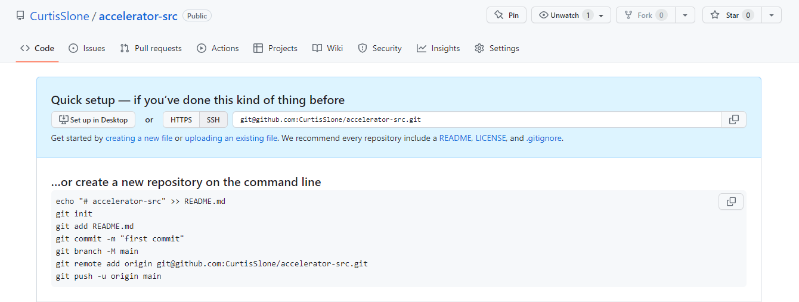
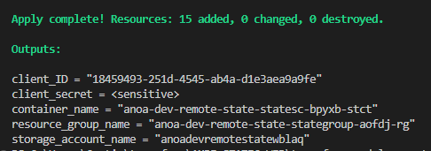
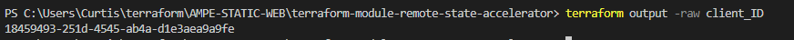
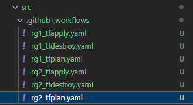
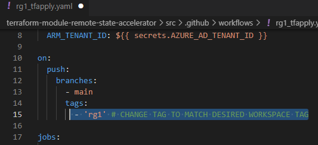
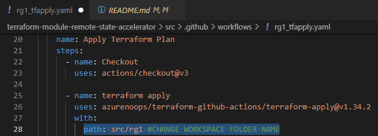
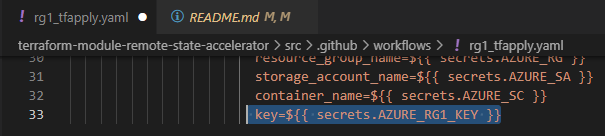
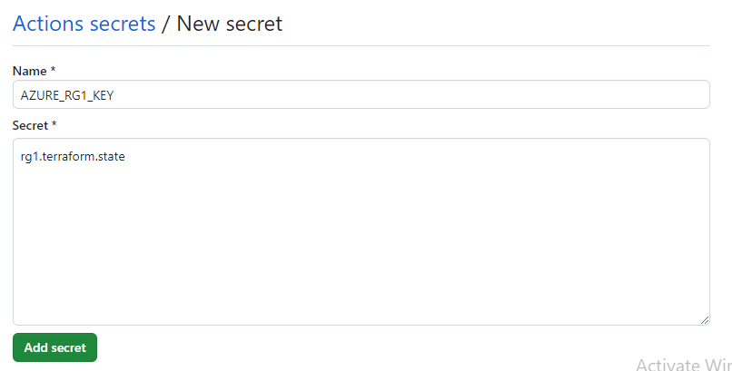

# Terraform Module Overlay Remote State

Automates remote state generation for faster development, testing, and deployment times.

## Purpose

Creates a remote-state resource group within a single subscription that manages multiple Terraform workspaces. This accelerator uses a combination of git tags and GitHub actions to automate the selection of the statefile.

### Resources Created
Resource Group
KeyVault
App Registration
Service Principal Name
Storage Account
Storage Container


## Usage

### Prequisites:

You must create a new github repository to host your terraform code. Create the repository on GitHub.

**DO NOT** Initialize a local branch.
**DO NOT** Stage any commits.

Leave the repository in the default new state. Like Below



### Steps:

Clone this repo to your desired local directory

```
git clone https://github.com/CurtisSlone/terraform-module-overlays-remote-state-accelerator
cd terraform-module-overlays-remote-state-accelerator
```

Log-In using AZ cli and set your desired subscription
```
az login
az account list
az account set --subscription "SUBSCRIPTION NAME"
```

Now you must initialize, plan and apply the semote state backend. In your current directory, execute the following commands.

```
terraform init
terraform plan
terrafor apply --auto-approve
```

Capture the outputs from your command line and insert them as secrets into your GitHub Secrets. Reference any actions file in the **actionTemplates** directory for naming convention of secrets. See figure below:


The outputs should be generated automatically. See figure below.


### Obtaining Client Secret
```
terraform output -raw client_secret
```

See Below


**Note:**  You may have a % attached at the end if you are on Mac or Linux. Do not copy this into the AZURE_AD_CLIENT_SECRET secret in GitHub.

After inputting all outputs into GitHub Secrets, create Github secrets for your tenant ID and Subscription ID. If you do not know them you can discover them using the following command.

```
az account show
```

Next, change directory into the src directory. This is where separate workspaces will be held. Each sub-directory of src represents a workspace. 

Within the src directory, you can run the git commands to initialize your diectory, create a local branch, connect your remote branch, and the push the contents of the src directory to the GitHub repository that your created.

Run the following commands:

```
cd src
git init
git add .
git commit -m "Initial Commit"
git branch -M main
git remote add origin git@github.com:<GH Username/Repository>
git push -u origin main
```

Each workspace sub-directory will require it's own tfstate key. Additionally, it will require it's own tag and actionfile.

First, add the relevant workspace tags via the git cli. Then push them to your remote branch

```
git tag <Workspace1_Tag>
git tag <Workspace2_Tag>
git push origin --tags
```

Now, copy the terraform action templates from the actionTemplates directory and past them in the .github/workslows directory. You will need a separate copy of each for each workspace. Name them apppropriately. See the figure below to view example file structure.



First, update the tag that is designated for it's relevant workspace. Update the path to include the relevant workspace. Identify the name of the terraform key files. Update the secret name in the appropriate github action file. See the figures below. See figures below.







Repeat these steps for the workspace terraform actions.

Then create the keyfile secret in GitHub.




