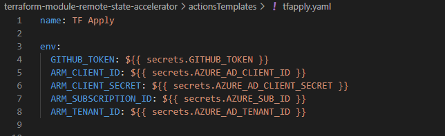
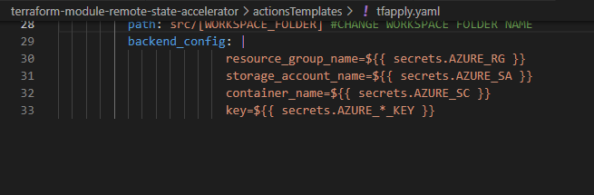
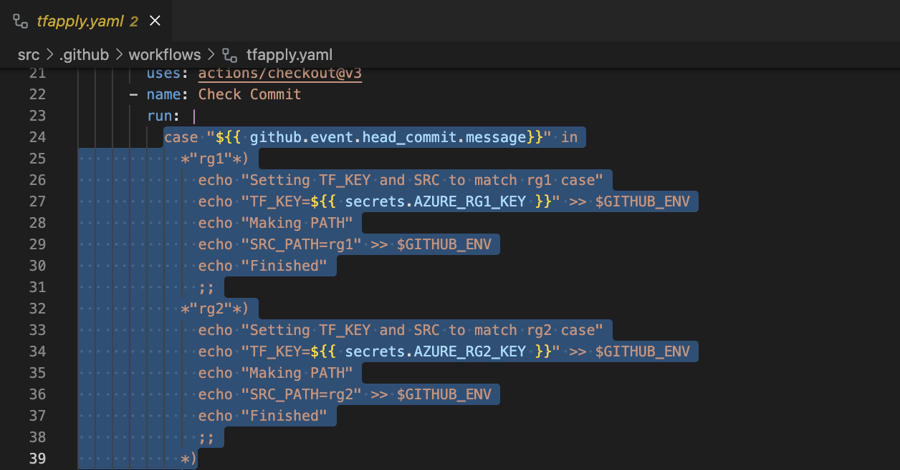
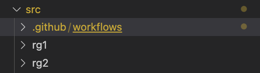

# Azure Remote-State Accelerator Terraform Overlay
[](CHANGELOG.md) [](NOTICE) [](LICENSE) [](https://registry.terraform.io/modules/azurenoops/overlays-template/azurerm/)

Terraform Module with GitHub Actions templates intended to lower development, testing, and deployment.

## Purpose

Creates a remote-state resource group within a single subscription that manages multiple Terraform workspaces. This accelerator uses GitHub Actions to automate the selection of the statefile using Bash logic and GitHub Actions.

## Contributing

If you want to contribute to this repository, feel free to to contribute to our Terraform module.

More details are available in the [CONTRIBUTING.md](./CONTRIBUTING.md#pull-request-process) file.

## Resources Used
* [Resource Group](https://registry.terraform.io/providers/hashicorp/azurerm/latest/docs/resources/resource_group)
* [KeyVault](https://registry.terraform.io/providers/hashicorp/azurerm/latest/docs/resources/key_vault)
* [KeyVault Policies](https://registry.terraform.io/providers/hashicorp/azurerm/latest/docs/resources/key_vault_access_policy)
* [KeyVault Secret](https://registry.terraform.io/providers/hashicorp/azurerm/latest/docs/resources/key_vault_secret)
* [App Registration](https://registry.terraform.io/providers/hashicorp/azuread/latest/docs/resources/application)
* [Service Principal Name](https://registry.terraform.io/providers/hashicorp/azuread/latest/docs/resources/service_principal)
* [Service Principal Name Password](https://registry.terraform.io/providers/hashicorp/azuread/latest/docs/resources/service_principal_password)
* [Storage Account](https://registry.terraform.io/providers/hashicorp/azurerm/latest/docs/resources/storage_account)
* [Storage Container](https://registry.terraform.io/providers/hashicorp/azurerm/latest/docs/resources/storage_container)


## Module Usage

### INPUTS

| **Input**                                        | **Value Type**                                |
|:------------------------------------------------  | ----------------------------------------: |
| **Global Inputs**                                     |                                           |
| org_name                                          | string                                    |
| location                                          | string                                    | 
| workload_name                                     | string                                    |
| **SPN Inputs**                                        |                                           |
| service_principal_name                            | string                                    |
| alternative_names                                 | list(string)                              |
| service_principal_description                     | string                                    |
| **KeyVault Inputs**                                   |                                           |
| purge_protection_enabled                          | bool                                      |
| soft_delete_retention_days                        | integer                                   |
| **Resource Lock Inputs**                              |                                           |
| enable_resource_locks                             | bool                                      |
| lock_level                                        | string                                    |

### OUPUTS
 **OUTPUT**                                        | **Value**                                |
|:------------------------------------------------  | ----------------------------------------: |
| resource_group_name         | azurerm_resource_group.staterg.name                  |
| storage_account_name          | azurerm_storage_account.tfstatesa.name                            | 
| container_name                | azurerm_storage_container.tfstatesc.name                         |
| client_ID                            | azuread_application.app.application_id             |
| client_secret          | azuread_service_principal_password.pass.value           |

### Example:

See [modules.remotestate.tf](https://github.com/CurtisSlone/terraform-module-overlays-remote-state-accelerator/blob/main/modules.remotestate.tf)

```terraform

module "mod_remote_state" {
  source = "./remote-state-generator"


    # Globals (Required)
    org_name = "anoa"
    location = "eastus"
    workload_name = "remote-state"

    # SPN ((Required))
    service_principal_name = "subscription-spn"
    alternative_names = []
    service_principal_description = "Updates subscription and TF workspaces"

    # KeyVault (Required)
    purge_protection_enabled = false
    soft_delete_retention_days = 7

    #Resource Locks (Not Required)
    enable_resource_locks = false
    lock_level = "CanNotDelete"
    


}

#Outputs
output "resource_group_name" {
  value = module.mod_remote_state.resource_group_name
}

output "storage_account_name" {
  value = module.mod_remote_state.storage_account_name
}

output "container_name" {
  value = module.mod_remote_state.container_name
}

output "client_ID" {
  value = module.mod_remote_state.client_ID
}

output "client_secret" {
  value = module.mod_remote_state.client_secret
  sensitive = true
}

# Versions

terraform {
  required_version = ">= 1.3"
  required_providers {
    azurerm = {
      source  = "hashicorp/azurerm"
      version = "~> 3.22"
    }
    azurenoopsutils = {
      source  = "azurenoops/azurenoopsutils"
      version = "~> 1.0"
    }
  }
}

provider "azurerm" {
  features {}
}
```

## GitHub Actions Usage

The GitHub Actions in the actionsTemplates directory are vital pieces to the accelerator. The actions us workload short-codes to identify workspaces in logic. Each tfstate file requires its own key which will be chosen in this logic.

Each workspace must be segregated in it's own folder within your working directory. The .github/workflows will be at the top level directory. See the figure below as an example.


### Walkthrough:

Clone this repo to your desired local directory

```
git clone https://github.com/CurtisSlone/terraform-module-overlays-remote-state-accelerator
cd terraform-module-overlays-remote-state-accelerator
```

Log-In using AZ cli and set your desired subscription
```
az login
az account list
az account set --subscription "SUBSCRIPTION NAME"
```

Now you must initialize, plan and apply the semote state backend. In your current directory, execute the following commands.

```
terraform init
terraform plan
terrafor apply --auto-approve
```

Capture the outputs from your command line and insert them as secrets into your GitHub Secrets. Reference the action files 'tfapply' or 'tfplan' in the **actionTemplates** directory for naming convention of secrets. See figure below:




The outputs should be generated automatically. See figure below.


### Obtaining Client Secret
```
terraform output -raw client_secret
```

See Below


**Note:**  You may have a % attached at the end if you are on Mac or Linux. Do not copy this into the AZURE_AD_CLIENT_SECRET secret in GitHub.

After inputting all outputs into GitHub Secrets, create Github secrets for your tenant ID and Subscription ID. If you do not know them you can discover them using the following command.

```
az account show
```

Finally, add relevant github secrets for your tfstate file. Make it workload relevant using a naming convention like **workload.terraform.state**.

Using this naming convention allows you create multiple terraform statefiles to switch between using the GitHub Action logic.

In this example we have, *rgOne.terraform.tfstate* and *rgTwo.terraform.tfstate*.

### Updating GitHub Action Templates

The GitHub Action files must be updated using identified workload 'short-codes'. These work as workload identifiers that are required to be in the pull-request title, and the commit.

First, update the yaml files 'tfapply' and 'tfplan' in the actionsTemplates directory. See figure below for example


**Example**




**Example Directory**



Please note the variable SRC_PATH in the actions file.

Apply these changes to both the tfapply and tfplan files in the actionsTemplate directory.

Next, change directory into the src directory. This is where separate workspaces will be held. Each sub-directory of src represents a workspace. 

Within the src directory, you can run the git commands to initialize your diectory, create a local branch, connect your remote branch, and the push the contents of the src directory to the GitHub repository that your created.

Run the following commands:

```
cd src
git init
git add .
git commit -m "Initial Commit"
git branch -M main
git remote add origin git@github.com:<GH Username/Repository>
git push -u origin main
```

#### HIGHLIGHTS

Add switches to case in action files. Identify workload 'short-codes'.

TFPlan uses pulls. The name of the pull-request must contain the workload short-code.

TF Apply uses pushes. The commit must contain the workload short-code.
