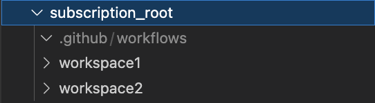

# Azure Remote-State Accelerator Terraform Overlay
[](CHANGELOG.md) [](NOTICE) [](LICENSE) [](https://registry.terraform.io/modules/azurenoops/overlays-template/azurerm/)

Terraform Module with GitHub Actions templates intended to lower development, testing, and deployment.

## Purpose

Creates a remote-state resource group within a single subscription that manages multiple Terraform workspaces. This accelerator uses GitHub Actions to automate the selection of the statefile using Bash logic and GitHub Actions.

## Contributing

If you want to contribute to this repository, feel free to to contribute to our Terraform module.

More details are available in the [CONTRIBUTING.md](./CONTRIBUTING.md#pull-request-process) file.

## Resources Used
* [Resource Group](https://registry.terraform.io/providers/hashicorp/azurerm/latest/docs/resources/resource_group)
* [KeyVault](https://registry.terraform.io/providers/hashicorp/azurerm/latest/docs/resources/key_vault)
* [KeyVault Policies](https://registry.terraform.io/providers/hashicorp/azurerm/latest/docs/resources/key_vault_access_policy)
* [KeyVault Secret](https://registry.terraform.io/providers/hashicorp/azurerm/latest/docs/resources/key_vault_secret)
* [App Registration](https://registry.terraform.io/providers/hashicorp/azuread/latest/docs/resources/application)
* [Service Principal Name](https://registry.terraform.io/providers/hashicorp/azuread/latest/docs/resources/service_principal)
* [Service Principal Name Password](https://registry.terraform.io/providers/hashicorp/azuread/latest/docs/resources/service_principal_password)
* [Storage Account](https://registry.terraform.io/providers/hashicorp/azurerm/latest/docs/resources/storage_account)
* [Storage Container](https://registry.terraform.io/providers/hashicorp/azurerm/latest/docs/resources/storage_container)


## Module Usage

### INPUTS

| **Input**                                        | **Value Type**                                |
|:------------------------------------------------  | ----------------------------------------: |
| **Global Inputs**                                     |                                           |
| org_name                                          | string                                    |
| location                                          | string                                    | 
| workload_name                                     | string                                    |
| **SPN Inputs**                                        |                                           |
| service_principal_name                            | string                                    |
| alternative_names                                 | list(string)                              |
| service_principal_description                     | string                                    |
| **KeyVault Inputs**                                   |                                           |
| purge_protection_enabled                          | bool                                      |
| soft_delete_retention_days                        | integer                                   |
| **Resource Lock Inputs**                              |                                           |
| enable_resource_locks                             | bool                                      |
| lock_level                                        | string                                    |

### OUPUTS
 **OUTPUT**                                        | **Value**                                |
|:------------------------------------------------  | ----------------------------------------: |
| resource_group_name         | azurerm_resource_group.staterg.name                  |
| storage_account_name          | azurerm_storage_account.tfstatesa.name                            | 
| container_name                | azurerm_storage_container.tfstatesc.name                         |
| client_ID                            | azuread_application.app.application_id             |
| client_secret          | azuread_service_principal_password.pass.value           |

### Example:

See [modules.remotestate.tf](https://github.com/CurtisSlone/terraform-module-overlays-remote-state-accelerator/blob/main/modules.remotestate.tf)

```terraform

module "mod_remote_state" {
  source = "./remote-state-generator"


    # Globals (Required)
    org_name = "anoa"
    location = "eastus"
    workload_name = "remote-state"

    # SPN ((Required))
    service_principal_name = "subscription-spn"
    alternative_names = []
    service_principal_description = "Updates subscription and TF workspaces"

    # KeyVault (Required)
    purge_protection_enabled = false
    soft_delete_retention_days = 7

    #Resource Locks (Not Required)
    enable_resource_locks = false
    lock_level = "CanNotDelete"
    


}

#Outputs
output "resource_group_name" {
  value = module.mod_remote_state.resource_group_name
}

output "storage_account_name" {
  value = module.mod_remote_state.storage_account_name
}

output "container_name" {
  value = module.mod_remote_state.container_name
}

output "client_ID" {
  value = module.mod_remote_state.client_ID
}

output "client_secret" {
  value = module.mod_remote_state.client_secret
  sensitive = true
}

# Versions

terraform {
  required_version = ">= 1.3"
  required_providers {
    azurerm = {
      source  = "hashicorp/azurerm"
      version = "~> 3.22"
    }
    azurenoopsutils = {
      source  = "azurenoops/azurenoopsutils"
      version = "~> 1.0"
    }
  }
}

provider "azurerm" {
  features {}
}
```

## GitHub Actions Usage

The GitHub Actions in the actionsTemplates directory are vital pieces to the accelerator. The actions us workload short-codes to identify workspaces in logic. Each tfstate file requires its own key which will be chosen in this logic.

Each workspace must be segregated in it's own folder within your working directory. The .github/workflows will be at the top level directory. See the figure below as an example.



### How the actions work

In the 'tfplan' and 'tfapply' actions, there is embedded logic that must be adjusted to fit each use case. The files create two GitHub environment variables called 'TF_Key' and 'SRC_PATH'. These variables change based on the workspace you choose using ***workspace short-codes***.

A workspace short-code is a short subtring in which to identify your workspace. See the table below for an example.

| **Workspace**                            | **Short-Code**                                  |
|:------------------------------------------------  | ----------------------------------------: |
| workspace1                                         | ws1                                  |
| workspace2                                         | ws2                                   | 

***NOTE:*** The workspace name matches the directory

### Short-Code Integration

**tfplan.yaml**

This file uses a pull-request based action. The chosen short-code must be in the pull request tile.

**tfapply.yaml**

This file uses a push based action. The chosen short-code must be in the most recent commit message.

### DEMONSTRATION:

**tfplan.yaml**

```yaml

-   name: Check Pull
                run: |
                    case "${{ github.event.pull_request.title }}" in
                        *"ws1"*)
                            echo "Setting TF_KEY and SRC to match ws1 case"
                            echo "TF_KEY=${{ secrets.AZURE_WS1_KEY }}" >> $GITHUB_ENV
                            echo "Making PATH"
                            echo "SRC_PATH=workspace1" >> $GITHUB_ENV
                            echo "Finished"
                            ;;
                        *"ws2"*)
                            echo "Setting TF_KEY and SRC to match ws2 case"
                            echo "TF_KEY=${{ secrets.AZURE_WS2_KEY }}" >> $GITHUB_ENV
                            echo "Making PATH"
                            echo "SRC_PATH=workspace2" >> $GITHUB_ENV
                            echo "Finished"
                            ;;
                        *)
                            echo "false"
                            exit 1
                            ;;
                    esac
```
**tfapply.yaml**

```yaml
- name: Check Commit
        run: |
          case "${{ github.event.head_commit.message}}" in
            *"ws1"*)
                echo "Setting TF_KEY and SRC to match ws1 case"
                echo "TF_KEY=${{ secrets.AZURE_WS1_KEY }}" >> $GITHUB_ENV
                echo "Making PATH"
                echo "SRC_PATH=workspace1" >> $GITHUB_ENV
                echo "Finished"
                ;;
            *"ws2"*)
                echo "Setting TF_KEY and SRC to match ws2 case"
                echo "TF_KEY=${{ secrets.AZURE_WS2_KEY }}" >> $GITHUB_ENV
                echo "Making PATH"
                echo "SRC_PATH=workspace2" >> $GITHUB_ENV
                echo "Finished"
                ;;
            *)
                echo "false"
                exit 1
                ;;
          esac
```

To add workspaces to the project. Simply create the workspace directory in your project, identify the short code, and insert the case into the 'tfplan' and 'tfapply' action templates. Additionally, you must decide what the name of the tfstate file for each workspace. In example, workspace1 will use 'wsOne.terraform.tfstate'. Each tfstate file will be added to the GitHub Secrets Accordingly

## GitHub Secrets

Below is a listing of the required secrets and their corresponding values from the terraform outputs.

### SECRETS:
 **GH Secret**                                      | **Output Value*                   |
|:------------------------------------------------  | ----------------------------------------: |
| AZURE_RG                                          | resource_group_name       |
| AZURE_SA                                          | storage_account_name      | 
| AZURE_SC                                          | container_name            |
| AZURE_AD_CLIENT_ID                                | client_ID                 |
| AZURE_AD_CLIENT_SECRET                            | client_secret             |

Below is a listing of GitHub Secrets that are not found in the module outputs. 

 **GH Secret**                                      | **Value*                   |
|:------------------------------------------------  | ----------------------------------------: |
| AZURE_SUB_ID                                       | Identified subscription ID      |
| AZURE_AD_TENANT_ID                                 | Tenant ID                       | 
| AAZURE_*_KEY                                       | *.terraform.tfstate             |